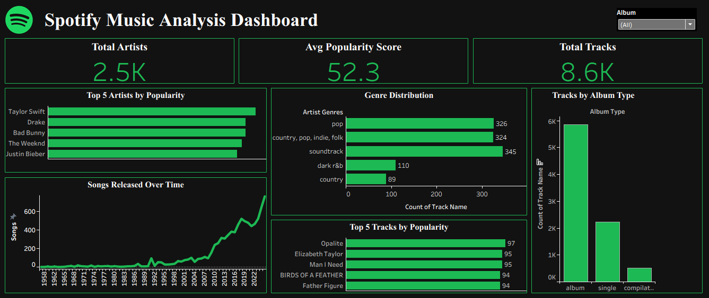

# Spotify Music Analysis Dashboard 🎧📊

This project analyzes Spotify music data to uncover patterns in track popularity, artist dominance, genre distribution, and music release trends.

## Key Highlights
- Analyzed 8.6K+ tracks across 2.5K artists
- Built an interactive Tableau dashboard with KPIs
- Identified popularity concentration where a small number of tracks and artists dominate attention
- Analyzed genre distribution and growth in music releases over time

## Dashboard Features
- KPIs: Total Artists, Total Tracks, Avg Popularity Score
- Top 5 Artists by Popularity
- Top 5 Tracks by Popularity
- Genre Distribution (Top genres by track count)
- Songs Released Over Time
- Tracks by Album Type

## Tools Used
- Tableau
- Data Analysis
- Data Visualization
- KPI Design
- Dashboard Design

## Preview

## Dataset
Public Spotify dataset cleaned and used for learning and analysis purposes.
